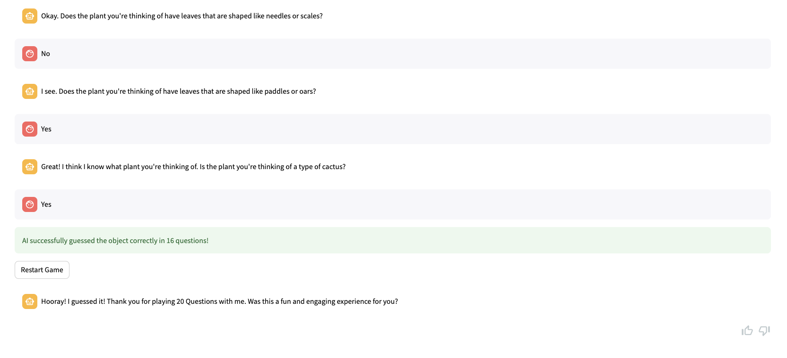

Twenty Questions Game
==============================

A GPT based LLM to play 20Q games with human to solve situational puzzle.

Cloud-based Architecture Design:
-----------------

A basic [hosted streamlit web app (accessible here)](https://ec2-35-178-210-239.eu-west-2.compute.amazonaws.com:8502) deployment design can be found below. Streamlit doesn't support serverless deployment yet, thus an EC2 instance was used for deployment:


However, in reality, deploying web app on an EC2 instance is very expensive. It's much cheaper to deploy over a set of serverless services. Some key components include:
1. **Web App with Amazon Amplify**: The frontend is hosted on AWS Amplify, a platform for building secure and scalable web applications. Amplify abstracts away much of the infrastructure management, which reduces costs by automatically scaling to meet demand and charging only for actual usage.
2. **Amazon API Gateway**: This service manages incoming API requests and routes them to the appropriate backend services, such as AWS Lambda functions. It's cost-effective because it scales automatically with the number of incoming requests and you pay only for the calls made to your APIs and the data transferred out.
3. **AWS Lambda**: The LLM Chain is executed in Lambda functions, which are event-driven and fully managed by AWS. This means no cost is incurred for idle server time, and you only pay for the compute time consumed, with a free tier available. An example function could be found [here](./lambda_app.py)
4. **LLM Foundational Models**: can be either using OpenAI API or SageMaker Jumpstart.
5. **Amazon CloudFront**: a fast CDN service that securely delivers data with low latency and high transfer speeds. CloudFront is integrated with AWS – both physically and through the AWS network backbone – which reduces the cost of content delivery.
6. **Amazon S3**: This service is used to store static assets for the web application, such as HTML, CSS, and JavaScript files, as well as for audit trail logs. S3 is cost-effective for storage because you pay only for what you use, and the pricing scales down with larger amounts of data.
7. **Amazon CloudWatch and CloudWatch Logs**: These services are used for monitoring the web app's usage and performance, as well as for operation logging and analysis. CloudWatch is a cost-effective way to monitor resources because you can pay for what you use and scale the service as needed.
8. **AWS IAM Roles**: AWS Identity and Access Management (IAM) controls access to AWS services and resources securely. Using IAM, you can set up roles with precise permissions, which is a best practice for security and cost control, as it helps prevent unauthorized access that could lead to unexpected charges.


Design Overview:
------------
This repo contains several design components:
- **LLM**: `gpt-3.5-turbo` model is used to chat with and generate responses for human. In this implementation, `AzureChatOpenAI` is utilised for having better latency performance than `ChatOpenAI`. I didn't use open-source LLMs due to the lack of computational power on my personal machine. 
- **Orchestrator**: `langchain` is used as the LLM orchestrator to 1) store conversation history for context-aware responses and tracking the game's progress (using `ConversationBufferMemory`) and 2) process user input and generate AI responses based on the customised prompt template (using `LLMChain`). 
- **Game**: The `TwentyQuestionsGame` class is designed to facilitate a game of "20 Questions". This class encapsulates the interaction between the human player and an AI model, managing the game flow and ensuring adherence to the game's rules. Having this class modularised, enables it to be deployed either as a RESTful API or integrated into the streamlit WebApp easily. In my repo, I presented both solutions.
- **Game prompt**: See below.
- **UI/UX & Audit trail logging**: `StreamlitChatApp` is a [streamlit-based](./streamlit_app.py) web app designed to engage users in a 20 questions game with LLM. `Streamlit` was chosen for its simplicity and efficiency in fine-tuning the right prompt and creating interactive web applications for better user experience. This class also records game activities, user interactions (e.g. binary inputs and feedback) and AI responses for future analysis and debugging.
- **Local bulk testing**: When I designed this solution, bulk testing enabled I evaluate my prompt template to see how it performed. I introduced another LLM (GPT3.5) to play with the GameAI. To test the bulk testing, simply run `python main.py bulk_test`
- **API Endpoint**: There are many ways to deploy the Langchain framework as an endpoint API. I created an [example](./lambda_app.py) of how to create an AWS Lambda function, executed upon triggering by an API requestt. 

Prompt Overview:
------------
Prompting was the most important element of this challenge. 
A clear system prompt has enabled the game to flow smoothly and meet the objectives.

**Objectives / rules of the game**:
1. The game is 20 questions - whereby the user think of something (i.e. a dog, a coffee, a display, a football) and the AI has to guess what they are thinking of.
2. The AI can only ask up to 20 binary (yes/no) questions to find out what the user is thinking of. The user can only answer yes/no truthfully.
3. The AI should should respond with an apologetic response when asked about something unrelated.

**Prompt design points**:
The prompt I used here is comprehensive and ensures that the AI follows a structured approach to the game, keeping it engaging, interactive, and rule-abiding.

1. **Welcome and Role Definition**: `Welcome to "20 Questions"! You are playing the role of a guesser, tasked with identifying an object chosen by the human player. `
2. **Define clear game objective and question format**
3. **Define response handling**: 
   - Response to 'No' Answers: The AI should offer a concise, apologetic response for incorrect guesses and then proceed with a different question.
   - Response to 'Yes' Answers: Upon receiving a 'Yes', the AI is directed to continue with its line of questioning to further deduce the object's identity.
4. **In-game intelligence**:
   1. Tracking question number
   2. End game reactions
   3. Hints and progress checking
   4. Encouragement and engagement with user
   5. Feedback opportunity 
   6. Adaptive strategy

Deployment Steps:
------------
To execute this app, you need to have either Azure OpenAI deployment and keys or OpenAI API key.

#### 0. LLM Set up
You can either configure these sensitive information from environment variables or from the streamlit app. 
```sh
OPENAI_API_TYPE=
OPENAI_API_KEY=
OPENAI_API_BASE=
OPENAI_API_VERSION=
DEPLOYMENT_NAME=
```

#### 1. Play the game on the streamlit app
You can spin up the streamlit app easily through Docker. I created a `Makefile` to enable easier deployment.  
```bash
$ make up
```

If you don't have docker installed, you can use conda to reach the streamlit app. Simply:
```bash
$ make create_environment
$ make requirements
$ streamlit run streamlit_app.py
```

You should be able to see the web app via https://localhost:8502.


You are able to leave feedback no matter the AI wins or loses the game. It will be saved in a logs so that the outputs can be used to future fine-tune our model. 



#### 2. Bulk test the game

You can add multiple test cases (concepts / objects) to the [data file](data/bulk_test/objects.txt).

Run the following command to test the AI performance. 
```bash
python main.py bulk_test
```

You will see the output results over 10 iterations in the following format `result - (concept, status, how many questions asked)`:
```markdown
detailed_results: [('train', 'Failure', 20), ('car', 'Success', 11), ('cow', 'Success', 14), ('shower', 'Success', 10), ('car', 'Success', 7), ('apple', 'Success', 16), ('tree', 'Success', 6), ('train', 'Failure', 20), ('tree', 'Success', 6), ('train', 'Failure', 20)]
success_count: 7
average_questions: 13.0
performance_score: 0.7
```


Project Organisation
------------

    .
    ├── Dockerfile                  # Docker configuration file for building Docker images.
    ├── LICENSE                     # The license file for the project.
    ├── Makefile                    # Contains automation commands for the project.
    ├── README.md                   # The main documentation file for the project.
    ├── data                        # Directory for storing data files.
    │   └── bulk_test               # Folder for bulk testing data or scripts.
    ├── docs                        # Documentation files for the project.
    ├── logs                        # Folder for log files generated by the application.
    │   └── game_logs.log           # Log file for the game sessions.
    ├── main.py                     # Main Python script for the project.
    ├── references                  # Reference materials and documents.
    │   └── images                  # Images used in documentation or as references.
    ├── reports                     # Reports generated from analyses, data, etc.
    │   └── figures                 # Graphs, plots, or figures for the reports.
    ├── requirements.txt            # List of Python package dependencies for the project.
    ├── setup.py                    # Setup script for installing the project as a package.
    ├── src                         # Source code for the project.
    │   ├── __init__.py             # Initialization file for the src package.
    │   ├── __pycache__             # Compiled Python files (cache).
    │   ├── streamlit_utils         # Utility scripts and modules for Streamlit integration.
    │   ├── twenty_questions_game.py# Main script for the "20 Questions" game logic.
    │   └── utils                   # Utility scripts and modules for general purposes.
    ├── streamlit_app.py            # Streamlit application script.
    └── test_environment.py         # Script for testing the project environment setup.

--------

<p><small>Project based on the <a target="_blank" href="https://drivendata.github.io/cookiecutter-data-science/">cookiecutter data science project template</a>. #cookiecutterdatascience</small></p>
